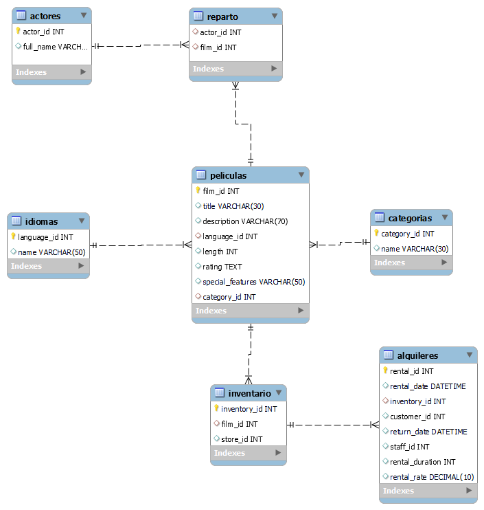

## 🧟‍♀ Introducción 🧜‍♀

El objetivo de este proyecto es la creación de una base de datos en MySQL. Para ello hay que limpiar y analizar los datos sobre peliculas y factores involucrados en las mismas. 

## 🧝‍♀ Trasfondo 🧙‍♂

Manolo se ha dado un golpe en la cabeza y está convencido de que el próximo boom empresarial va a ser el de alquileres de películas en físico, rollo los 90... Me ha contratado por fiverr para que revise un disco duro que le dejó su padre y le diga que películas había para comenzar con el 'nuevo' negocio...

## 🧛‍♀ Objetivos 🥷

- Estudio de datos 
- Limpieza de datos
- Creación y carga de base de datos 
- ERD - Entity Relationship Diagram (.sql) 
- Bonus: 5-10 querys

#### 📖 Estudio

1. Importar librerías y descargar los documentos csv
2. Exploración inicial

#### 🧹 Limpieza

1. Duplicados
2. Valores nulos
3. Valores únicos
4. Datos innecesarios

#### 📚 Creación y carga de base de datos 

1. Eliminar columnas innecesarias
2. Unión de dataframes
3. Creación de csv's limpios

#### 🪢 ERD

1. Diagrama inicial manual

2. Diagrama en MySQL

#### ⭐ Bonus: 5-10 querys

## 🦸 Conclusiones 🦹

- No hacía falta el dataframe de disco_duro_viejo, en cambio lo transforme para que sirviese de anclaje n-n entre actores y peliculas
- Había columnas innecesarias que se eliminaron 
- El dataframe de categorias no necesitaba estar en disco_duro_viejo sino en peliculas
- Había columnas de peliculas que tenían más sentido en inventario y alquileres

PD: Manolo por favor no abras la tienda, vete al médico 